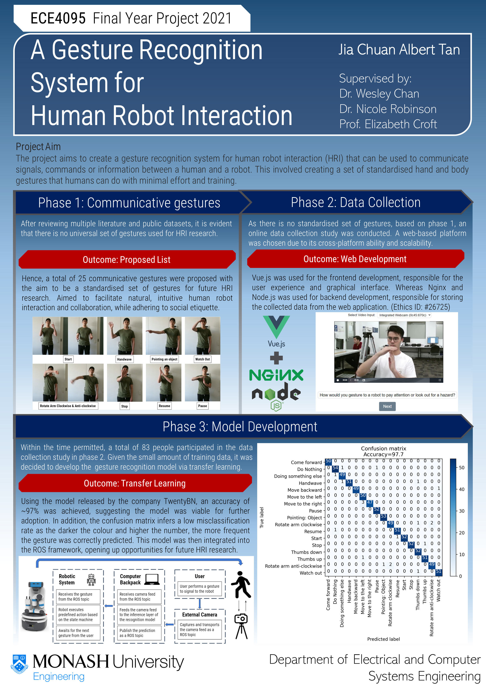

# ECSE Final Year Project 2021

<!-- TABLE OF CONTENTS -->
<p align="center">
    <a href=#introduction> Introduction </a> •
    <a href=#dependencies> Dependencies </a> •
    <a href=#gestures> Gestures </a> •
    <a href=#setup> Setup </a> •
    <a href=#usage> Usage </a>
</p>

---

## Introduction

This repository integrates a gesture recognition system into the ROS framework to further facilitate human robot interaction research. Based on current literature, there is no standardised set of gestures used for human robot interaction. Hence, this projects aims to address this issue by compiling a set of communicative body and hand gestures, with the aim of creating a standardised list for future research in this space.

More details about the proposed gestures can be found [here](#gestures).

This system was also used to communicate between a user and a Fetch robot. More details about this can be found [here](#).

## Poster

This repository was written for my ECSE Final Year Project.

<p align='center'>
    
</p>

## Gestures

After reviewing current literature, we have compiled a list of gestures to be used for this project.
To validate our model, we decided to use [sense](https://github.com/TwentyBN/sense) as the main backbone of our project.
To leverage this gesture recognition model, we conducted a data collection study to collect a more diversifed dataset to train a custom model.

<p align="center">
    
    
</p>

*(The full list of gestures can be found [here](https://youtube.com/playlist?list=PL-MdrmgE0ZdsBIVYdPruDXcg29n1nCLXA))*


# hiROS

This repository was constructed using ROS Melodic (Robot Operating System) framework and uses [sense](https://github.com/TwentyBN/sense) as the main backbone.

## Dependencies
- ROS Melodic
- [sense](https://github.com/TwentyBN/sense)
- Python 3

## Setup

### Python3 for ROS Melodic

Since this repository is built in Python3 and ROS Melodic uses Python2.7, you need to first build [opencv_vision](https://github.com/ros-perception/vision_opencv) in Python3 and extend your main workspace (i.e. catkin_ws).

Once you have installed all the right dependancies for [opencv_vision](https://github.com/ros-perception/vision_opencv), you have to build your workspace. 

More details can be found from this [site](https://medium.com/@beta_b0t/how-to-setup-ros-with-python-3-44a69ca36674) for reference.

```
$ mkdir -p ~/build_ws/src
$ cd ~/build_ws/src
$ git clone -b melodic https://github.com/ros-perception/vision_opencv.git
$ cd ~/build_ws
$ catkin build cv_bridge
```

Once you build it, you will need to extend it into your main working environment (in this example it is catkin_ws). You will need to do this every time you rebuild your workspace

```
$ cd ~/catkin_ws
$ catkin_make
$ source devel/setup.bash
$ source ~/build_ws/devel/setup.bash --extend
```


## Usage

Once you have setup your environment, as shown from [setup](#setup), you can run the inference layer. Run <kbd> rqt </kbd> to view the result. 

```
# To just run the inference layer
$ roslaunch hiROS inference.launch

# To run the inference layer with [video_stream_opencv]() package
# kinect = true (if you are using kinect)
# camera = 0 (change camera id if you have multiple cameras)
$ roslaunch hiROS interface.launch kinect:=false camera:=0

# To just use the camera, you can run this two launch files
$ roslaunch video_stream_opencv webcam.launch
$ roslaunch video_stream_opencv camera.launch
```

To work on the Fetch robot, you need to enable SSH to communicate with it. In this case, the master should be the Fetch and the Follower should be your device.

```
# On personal device, run
$ export ROS_MASTER_URI=http://[Fetch robot IP]:11311/
$ export ROS_IP=[personal device IP]
```

For my project, I used these commands below:
```
# On personal device
$ export ROS_MASTER_URI=http://160.69.69.80:11311/
$ export ROS_IP=160.69.69.129
$ roslaunch hiROS interface.launch kinect:=false camera:=0

# On Fetch
$ ssh hrigroup@160.69.69.80
$ roslaunch hiros_smach robot.launch
$ rosrun hiros_smach main.py
```
