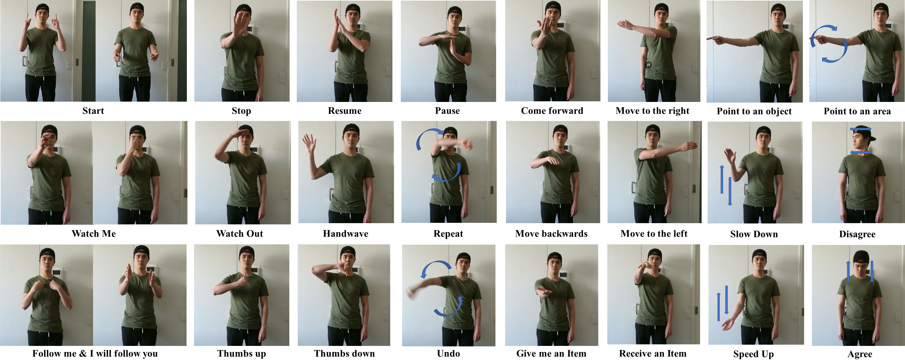

# hiROS

<!-- TABLE OF CONTENTS -->
<p align="center">
    <a href=#introduction> Introduction </a> •
    <a href=#gestures> Gestures </a> •
    <a href=#hiros> hiROS </a> •
    <a href=#dependencies> Dependencies </a> •
    <a href=#setup> Setup </a> •
    <a href=#usage> Usage </a>
</p>

---

## Introduction

We proposed a set of communicative gestures for Human Robot Interactin and an RGB Image-based Gesture Recognizer Implemented in ROS. The aim of this project is to facilitate a more intuitive Human-Robot Interaction (HRI) through gestures.

First, we propose a set of commands commonly used for human-robot interaction. Next, an online user study was conducted with a total of 190 participants. This was done to investigate if there was an agreed set of gestures that people intuitively used to communicate the given commands to robots when no guidance or training were given.

As we found large variations among the gestures exist between participants, we proposed a set of [gestures for the proposed commands](#gestures) to be used as a common foundation for the robot interaction. We collected ~7500 video demonstrations of the proposed gestures and trained a gesture recognition model, adapting a 3D Convoluytional Neural Netowrk (CNN) as the classifer, with a final accuracy of 84.1%. The model was capable of training successfull with a relatively small amount of training data.

The model was then integrated into the ROS framework and report details for a demonstrated use case, where a person commands a robot to perform a pick and place task using the proposed set. This integrated ROS gesture recognition system is made available for use, and built with the intention to allow for new adaptions depending on robot model and use case scenarios, for novel user applications. For our demonstration, we used this system to communicate between a user and a Fetch robot as shown below.

<p align="center">
    
</p>


<!-- ## Poster

This repository was written for my ECSE Final Year Project.

<p align='center'>
    
</p> -->


## Gestures

We have proposed a set of commands that may be commonly used for human-robot interaction, shown in the table below. To validate our model, we used [sense](https://github.com/quic/sense) (action recognition model) as the backbone of our system. To leverage this model, we conducted a data collection study to collect a more diversifed dataset to train a custom model. Two additional gesture of "doing nothing" and "doing something else" were also introduced. These two classes are used to identify when the user is idle or performing non-communicative gestures.

<p align="center">
    
</p>

<center>

| List of Proposed Commands | &nbsp; |&nbsp; |
| :--------------- | :---------------          | :---------------       |
| 1. Start         | 10. Point to an Object    | 18. Thumbs up          | 
| 2. Stop          | 11. Point to an Area      | 19. Thumbs down        |
| 3. Handwave      | 12. I will Follow You     | 20. Give me an item    |
| 4. Resume        | 13. Follow Me             | 21. Receive an item    | 
| 5. Pause         | 14. Watch Me              | 22. Move backwards     | 
| 6. Agree         | 15. Watch Out             | 23. Come forward       | 
| 7. Disagree      | 16. Speed up              | 24. Move to the left   |
| 8. Repeat        | 17. Slow down             | 25. Move to the right  |
| 9. Undo          | &nbsp;                    | &nbsp;                 | 

</center>

*(The full list of video demonstration for each gesture can be found [here](https://youtube.com/playlist?list=PL-MdrmgE0ZdsBIVYdPruDXcg29n1nCLXA))*


## Gesture Recognition Model

Total number of participants: ~190

Stage 1: Participants were asked how they would gesture to a robot to best convey a given command (i.e. "How would gesture to tell a robot to stop in place?')

Stage 2: Participants were shown a video demonstration of how to gesture each command, and then asked to perform each demonstrated gesture after viewing the video example.

Data collected from each respective stage were trained using the [sense](https://github.com/quic/sense) action recognition model. The model accuracy and confusion matrix is shown below. The model was trained for 100 epochs, with the performance converging after the 80th epoch. The model accuracy was also validated using multi-fold cross validation, with k=5.

<center>

Average number of videos per gesture | Stage 1 Accuracy | Stage 2 Accuracy  |
:---:   | :---:         | :---:         |
~50     | 17.2 ± 3.3%   | 81.0 ± 1.3%   |
~100    | 19.7 ± 2.6%   | 79.2 ± 2.1%   |
~150    | 21.6 ± 2.2%   | 82.0 ± 1.9%   |


</center>

<p align="center">
    
    
</p>


## Dependencies

This repository was constructed using ROS Melodic (Robot Operating System) framework and uses [sense](https://github.com/TwentyBN/sense) as the main backbone.

- ROS Melodic
- [sense-for-HRI](https://github.com/alberttjc/sense-for-HRI)
- Python 3

## Setup

### **Python3 for ROS Melodic**

Since this repository is built in Python3 and ROS Melodic uses Python2.7, you need to first build [opencv_vision](https://github.com/ros-perception/vision_opencv) in Python3 and extend your main workspace (i.e. catkin_ws).

Once you have installed all the right dependancies for [opencv_vision](https://github.com/ros-perception/vision_opencv), you have to build your workspace. 

More details can be found from this [site](https://medium.com/@beta_b0t/how-to-setup-ros-with-python-3-44a69ca36674) for reference.

```
$ mkdir -p ~/build_ws/src
$ cd ~/build_ws/src
$ git clone -b melodic https://github.com/ros-perception/vision_opencv.git
$ cd ~/build_ws
$ catkin build cv_bridge
```

Once you build it, you will need to extend it into your main working environment (in this example it is catkin_ws). You will need to do this every time you rebuild your workspace

```
$ cd ~/catkin_ws
$ catkin_make
$ source devel/setup.bash
$ source ~/build_ws/devel/setup.bash --extend
```

### **Gesture Recognition Model (Sense)**

Before you can use it, pleaes check out the gesture recognition system [here](https://github.com/alberttjc/sense-for-HRI).

<p align="center">
    
</p>


## Usage

Once you have setup your environment, as shown from [setup](#setup), you can run the inference layer.

Run <kbd> rqt </kbd> to view the result. 

```
# To just run the inference layer
$ roslaunch hiROS inference.launch

# To run the inference layer with [video_stream_opencv]() package
# kinect = true (if you are using kinect)
# camera = 0 (change camera id if you have multiple cameras)
$ roslaunch hiROS interface.launch kinect:=false camera:=0

# To just use the camera, you can run this two launch files
$ roslaunch video_stream_opencv webcam.launch
$ roslaunch video_stream_opencv camera.launch
```

### **Thresholds**

You can change the thresholds from each gesture used in this file <kbd> scripts/thresholds.py </kbd>.


### **Opearting with a Fetch robot**

To work on the Fetch robot, you need to enable SSH to communicate with it. In this case, the master should be the Fetch and the Follower should be your device.

```
# On personal device, run
$ export ROS_MASTER_URI=http://[Fetch robot IP]:11311/
$ export ROS_IP=[personal device IP]
```

For my project, I used these commands below:
```
# On personal device
$ export ROS_MASTER_URI=http://160.69.69.80:11311/
$ export ROS_IP=160.69.69.129
$ roslaunch hiROS interface.launch kinect:=false camera:=0

# On Fetch
$ ssh hrigroup@160.69.69.80
$ roslaunch hiros_smach robot.launch
$ rosrun hiros_smach main.py
```

